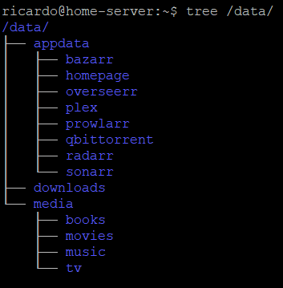

# MediaServer

---

---

# Início

- Installar Ubuntu ´Server´
- `sudo apt update && sudo apt upgrade -y`
- `sudo apt install net-tools`
- `sudo apt install docker.io`

```powershell
sudo groupadd docker
sudo usermod -aG docker $USER
#Dar restart para assumir
```

- Criar a folder principal com as respetivas subfolders

```powershell
sudo mkdir -p /data/{downloads,appdata/{radarr,sonarr,bazarr,prowlarr,overseerr,homepage,plex,qbittorrent},media/{movies,tv,music,books}}
```



- Dizer que a pasta /data é do $USER

```powershell
sudo chown -R $USER:$USER /data/
sudo chmod -R a=,a+rX,u+w,g+w /data/
```

- Instalar Portainer para ter visualização dos containers

```powershell
docker volume create portainer_data
docker run -d -p 8000:8000 -p 9443:9443 --name portainer --restart=always -v /var/run/docker.sock:/var/run/docker.sock -v portainer_data:/data portainer/portainer-ce:latest
```

- Dar run ao compose com os serviços todos

```powershell
sudo apt install docker-compose
docker-compose -f $file.yaml up -d 
```

[Servarr.yaml](Servarr.yaml)

# *arr Configs

## Radarr

- Definir root path como /data/media/movies
- Mudar os `Profiles` de qualidade se for preciso (Tirei REMUX e BluRay porque são ficheiro muito grandes apesar de ser a melhor qualidade)
- Adicionar `Download Clients`

## Sonarr

- Definir `Root Path` como /data/media/tv
- Mudar os `Profiles` de qualidade se for preciso
- Adicionar `Download Clients`

## Prowlarr

- Adicionar `Indexers`
- Adicionar `Radarr` e `Sonarr` às `Apps`

## qBitTorrent

- Dar login com admin e a pass que está nos Logs, assim que se entrar, mudar o login e password nas settings
- Ajustar o `Default Save Path` para `/data/downloads`
- Ajustar o `Bit Torrent/Seeding Limit`

## Bazarr

- Adicionar as linguas no `Languages Filter`
- Criar `Profile`  com as linguas adicionas
- Dar enable ao `Series` e `Movies` e escolher a `Profile`  criada
- Adicionar `Providers`
- Dar Enable ao Sonarr e Radarr - Meter IP e API Key

## Plex

- Entrar no `IP:32400/web` e seguir o wizard

## Overseer

- Dar login pelo plex e seguir o wizard

## Homepage

- Alterar os ficheiros `config.yaml` e `services.yaml` de acordo com o necessário
- [https://gethomepage.dev/latest/](https://gethomepage.dev/latest/) +info

# IP Estático

- `sudo apt-get install network-manager`
- Aceder a `/etc/netplan` e criar ou abrir o ficheiro.

- Alterar o ficheiro `00-xxx.yaml` para algo do género


- [https://ubuntu.com/server/docs/configuring-networks](https://ubuntu.com/server/docs/configuring-networks) +info

# NGINX

- Instalar NGINX

```powershell
sudo apt update
sudo apt install nginx
```

- `/var/www/html`  para alterar o html do nginx

# DNS - BIND9

- Começar por instalar o BIND9

```powershell
sudo apt update
sudo apt install bind9
```

- Testar o bind9

```powershell
nslookup google.com 127.0.0.1
```

- Dar allow na firewall

```powershell
sudo ufw allow Bind9
```

- Configurar o `etc/bind/named.conf.option`

```powershell
options {
    directory "/var/cache/bind";
    forwarders {
        8.8.8.8;
    };
    dnssec-validation auto;
    auth-nxdomain no;    # conform to RFC1035
    version "get lost";
    allow-transfer {"none";};
    recursion yes ;
    allow-recursion { any; };
    allow-query {any;};
    querylog yes ;
    empty-zones-enable no;
};

zone "nginx.home.arpa" {
    type master;
    file "/etc/bind/zones/db.nginx.home.arpa";
};
```

- Criar o diretorio `zones` e o `db.$zone` dentro do diretorio
- Configurar o ´etc/bind/zones/db.nginx.home.arpa

```powershell
$TTL    604800
@       IN      SOA     nginx.home.arpa. root.nginx.home.arpa. (
                              1         ; Serial
                         604800         ; Refresh
                          86400         ; Retry
                        2419200         ; Expire
                         604800 )       ; Negative Cache TTL
;
@       IN      NS      ns.nginx.home.arpa.
ns      IN      A       172.29.1.180
@       IN      A       172.29.1.180

;also list other computers
box     IN      A       172.29.4.146
```

- Testar o domain com `nslookup nginx.home.arpa`

# Terraria

- Criar um diretorio para o config `mkdir -p /terraria/config`
- Criar o compose file e corre-lo

```powershell
services:
  terraria-docker:
    image: passivelemon/terraria-docker:latest
    container_name: terraria-docker
    ports:
       - 7777:7777
    volumes:
      - /terraria/config:/opt/terraria/config/
```